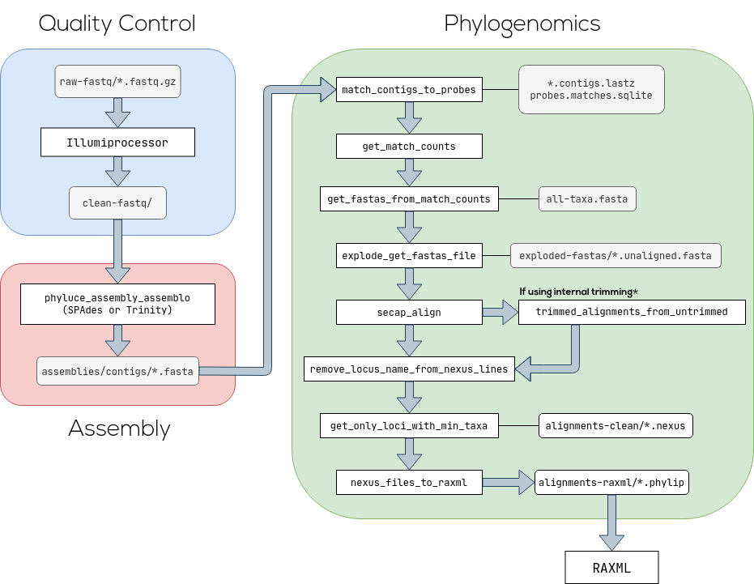

<p>
    

</p>

[](https://github.com/uceasy/uceasy/actions?workflow=Tests)
[](https://sonarcloud.io/dashboard?id=uceasy_uceasy)
[](https://zenodo.org/badge/latestdoi/203415455)

# UCEasy: A software package for automating and simplifying the analysis of ultraconserved elements (UCEs)


__UCEasy__ is a Python wrapper that standardizes, automates, and simplifies the following [PHYLUCE](https://phyluce.readthedocs.io/en/latest) tasks: quality control of raw reads, assembly, alignment and UCE loci extraction


At the moment, the major software package for analysing [ultraconserved elements](https://www.ultraconserved.org/) (UCEs) is PHYLUCE, but its execution can be quite challenging especially for non-computer experts.
__UCEasy__ is a convenient tool that automates the execution of common tasks for most types of UCE analysis, these being Quality Control, Assembly and Alignment of UCEs.

For more information check out our [Wiki](https://github.com/uceasy/uceasy/wiki).
## Installation Guide
### Dependencies
* Python ^3.7
* PHYLUCE 1.6.* (1.7 not supported yet)

Install the package from [PyPI](https://pypi.org/project/uceasy/):
```
$ pip install uceasy
```
Then, make sure you have a working installation of PHYLUCE, check out the installation guide at [PHYLUCE's documentation](https://phyluce.readthedocs.io/en/latest/installation.html).


## Workflow
The operations [Trim](https://github.com/uceasy/uceasy/wiki/Trim), [Assemble](https://github.com/uceasy/uceasy/wiki/Assemble) and [Align](https://github.com/uceasy/uceasy/wiki/Align) represent the following workflow.

<p>
    

</p>

The colored boxes are UCEasy CLI commands.
```
$ uceasy trim
$ uceasy assemble
$ uceasy align
```
Explore the options for these commands with the `--help` flag.<br>

For a guide of how to use UCEasy see: [Tutorial](https://github.com/uceasy/uceasy/wiki/Tutorial).


## Acknowledgements

We thank the following institutions, which contributed to ensuring the success of our work:

Ministério da Ciência, Tecnologia, Inovação e Comunicação (MCTIC)

Museu Paraense Emílio Goeldi (MPEG)

Instituto Nacional de Pesquisas da Amazônia (INPA)

Centro Universitário do Estado do Pará (CESUPA)

## Funding

 This research was supported  by Conselho Nacional de Desenvolvimento Científico e Tecnológico - CNPq (fellowships 149985/2018-5; 129954/2018-7). Romina Batista was supported by a postdoctoral fellowship granted from Coordenação de Aperfeiçoamento de Pessoal de Nível Superior – Brasil (CAPES-INPA proc. 88887477562/2020-00).


## Authors

 Caio Vinícius Raposo Ribeiro<br>
 Lucas Peres Oliveira<br>
 Romina Batista<br>
 Marcos Paulo Alves de Sousa


 ## Contact

Dr. Marcos Paulo Alves de Sousa (Project leader)

_Email: **msousa@museu-goeldi.br**_<br>
_Laboratório de Biologia Molecular-LBM_<br>
_Grupo de pesquisa em Bioinformática e Informática para Biodiversidade (BioInfo)_<br>
_Museu Paraense Emílio Goeldi_<br>
_Av. Perimetral 1901. CEP 66077- 530. Belém, Pará, Brazil._
